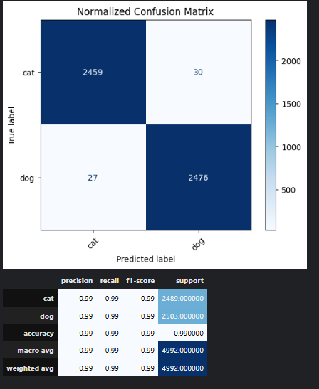

# 🐾 Cats vs Dog - Image Classification

🧠 Binary image classification using transfer learning with ResNet50 on the classic Cats vs Dogs dataset.

## 📁 Dataset
- Kaggle Dogs vs Cats competition
- 25,000 labeled images (cats and dogs)
- Balanced binary classification problem

## 🧪 Approach
- Custom EDA on image data: size, shape, grayscale, blur, duplicates
- Data cleaning: flagged + removed mislabeled or corrupted images
- Preprocessing: resizing to 256x256, `preprocess_input`, augmentation
- Model: frozen ResNet50 as feature extractor + custom dense head

📦 EDA techniques included:
- Grayscale filter detection  
- Blur detection via Laplacian  
- Size outlier flagging  
- Duplicate detection via hashing

📊 Confusion Matrix on Validation Set

📂 Notebook
👉 [View on Kaggle]([https://www.kaggle.com/code/victoriacabrerag/catdog-99-acc-resnet50])

Built with ❤️ by Victoria Cabrera
